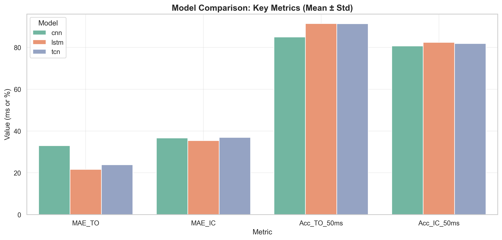

# Gait Event Detection using Deep Learning and Foot-Mounted IMUs

Automated detection of gait events (Initial Contact / Toe-Off) 
from foot-mounted Inertial Measurement Unit (IMU) signals, 
using three deep learning architectures evaluated under 
Leave-One-Subject-Out cross-validation.

**Research project** — M2 Artificial Intelligence & Data Science,  
LISSI Laboratory, Université Paris-Est Créteil (UPEC)



---

## Research Context

This project was conducted in collaboration with the 
**LISSI Laboratory (UPEC)** as part of an M2 thesis on 
automated gait analysis from wearable sensors.

The objective was to develop and benchmark deep learning models 
capable of detecting discrete gait events — **Initial Contact (IC)** 
and **Toe-Off (TO)** — from continuous IMU signals recorded at 
100 Hz on both feet, with the goal of supporting clinical 
gait analysis workflows.

> ⚠️ **Note on label reliability**: Ground truth annotations 
> were produced manually by clinical supervisors and acknowledged 
> as approximate. This affected model generalization and was the 
> primary factor limiting the publication track.

---

## Models

| Model | Architecture | Key characteristic |
|-------|-------------|-------------------|
| **CNN** | 1D Convolutional Network | Batch norm + dropout, fast convergence |
| **LSTM** | Bidirectional Recurrent Network | Sequence-to-sequence event detection |
| **TCN** | Causal Temporal Convolutional Network | Residual blocks, real-time compatible |

All models share a common abstract base class and output 
binary event predictions for IC and TO on both left and right feet.

---

## Experimental Results

All models evaluated using **Leave-One-Subject-Out (LOSO)** 
cross-validation across 10 subjects.

### Detection Accuracy (50ms tolerance window)

| Model | Acc TO @50ms | Acc IC @50ms | F1 TO | F1 IC |
|-------|-------------|-------------|-------|-------|
| **LSTM** | **91.4% ± 4.3%** | 82.4% ± 10.0% | **0.788 ± 0.086** | 0.766 ± 0.109 |
| **TCN** | 91.3% ± 4.7% | 81.9% ± 10.2% | 0.778 ± 0.075 | 0.760 ± 0.109 |
| **CNN** | 85.0% ± 7.3% | 80.7% ± 9.7% | 0.642 ± 0.098 | 0.719 ± 0.095 |

### Timing Precision (MAE in ms)

| Model | MAE TO | MAE IC |
|-------|--------|--------|
| **LSTM** | **21.6 ± 7.6 ms** | 35.4 ± 15.4 ms |
| **TCN** | 23.8 ± 9.9 ms | 36.9 ± 16.8 ms |
| **CNN** | 33.0 ± 17.6 ms | 36.6 ± 14.5 ms |

### Key Findings

- **LSTM achieves best overall performance** on Toe-Off detection
  (MAE: 21.6ms, Acc@50ms: 91.4%)
- **TCN is competitive with LSTM** while offering a causal 
  architecture suitable for real-time inference
- **High inter-subject variability** (large std) reflects 
  sensitivity to label quality — a known limitation of 
  manually annotated clinical datasets

---

## Project Structure
```
gait_cycle/
├── config.py                    # Hyperparameters and project constants
├── main.py                      # Evaluation pipeline entry point
├── requirements.txt
│
├── src/                         # Core library
│   ├── models/
│   │   ├── base.py              # Abstract base class for all models
│   │   ├── cnn.py               # CNN architecture + inference
│   │   ├── lstm.py              # LSTM architecture + inference
│   │   └── tcn.py               # TCN architecture + inference
│   ├── data_loader.py           # IMU data loading and preprocessing
│   ├── dataset.py               # PyTorch Dataset (sliding-window + LOSO)
│   ├── evaluator.py             # Metrics: MAE, RMSE, Accuracy, F1
│   └── utils.py                 # Event post-processing utilities
│
├── scripts/                     # Training and visualization
│   ├── train_common.py          # Shared training utilities
│   ├── train_cnn.py             # CNN training (LOSO cross-validation)
│   ├── train_lstm.py            # LSTM training
│   ├── train_tcn.py             # TCN training
│   ├── visualize_results.py     # CLI entry point for plot generation
│   └── plots/                   # Modular plot library
│       ├── comparison.py        # Model comparison charts
│       ├── signals.py           # IMU signal + event visualization
│       ├── statistics.py        # Per-subject box plots
│       └── data_loader.py       # Result loading for plots
│
└── outputs/
    ├── plots/                   # Generated figures (tracked)
    └── {cnn,lstm,tcn}/
        └── evaluation_summary.csv  # Aggregate metrics (tracked)
```

---

## Installation
```bash
git clone https://github.com/ramzimarir/gait-event-detection.git
cd gait-event-detection
python -m venv venv
source venv/bin/activate      # Windows: venv\Scripts\activate
pip install -r requirements.txt
```

---

## Usage

### 1. Prepare your data

Place IMU CSV files in `data/`. Required columns:
```
time, x_acc_left, y_acc_left, z_acc_left,
x_acc_right, y_acc_right, z_acc_right,
x_gyro_left, ..., x_gyro_right, ...,
quat_1_left, ..., quat_1_right, ...,
TO_left, IC_left, TO_right, IC_right
```

> The dataset used in this research is proprietary to the 
> **LISSI Laboratory** and cannot be redistributed.

### 2. Train a model
```bash
python scripts/train_lstm.py --epochs 50 --batch-size 32 --lr 1e-3
python scripts/train_tcn.py  --epochs 50 --batch-size 32 --lr 2e-3
python scripts/train_cnn.py  --epochs 50 --batch-size 64 --lr 1e-3
```

Optional: `--window-size`, `--overlap`, `--device cuda`

### 3. Run evaluation
```bash
python main.py --model lstm
python main.py --model tcn
python main.py --model cnn
```

### 4. Generate plots
```bash
python scripts/visualize_results.py lstm tcn cnn
```

Outputs saved to `outputs/plots/`.

---

## Evaluation Metrics

All metrics computed per model, per subject, per event type (IC/TO):

- **MAE** — Mean Absolute Error (ms) between predicted and ground-truth events
- **RMSE** — Root Mean Squared Error (ms)
- **Accuracy @20ms / @50ms** — Correctly detected events within tolerance window
- **Precision / Recall / F1** — Standard detection metrics

---

## Citation
```bibtex
@mastersthesis{marir2026gait,
  title   = {Gait Event Detection using Foot-Mounted IMUs 
             and Deep Learning},
  author  = {Ramzi Marir},
  year    = {2026},
  school  = {Université Paris-Est Créteil Val-de-Marne},
  note    = {LISSI Laboratory}
}
```

---

## License

This project is provided for educational and research purposes.  
The IMU dataset is proprietary to the LISSI Laboratory (UPEC) 
and is not included in this repository.

---

## Author

**Ramzi Marir** — M2 AI & Data Science, UPEC Paris  
Research conducted at LISSI Laboratory